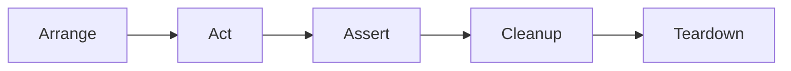

# Trello API Automation Framework


## 📖 About The Project

This project demonstrates a **production-grade API test automation framework** for the [Trello REST API](https://developer.atlassian.com/cloud/trello/rest/). It showcases modern software engineering practices including clean architecture and enterprise-level CI/CD implementation.

> 📊 **Live Dashboard:** Detailed test execution results, including graphs and step-by-step logs, are available in the **[Live Allure Report](https://cornelisp.github.io/TrelloApiTests/)**.
### Key Features

*  **Service Object Pattern** - Complete separation of test logic from API implementation
* ️ **Layered Architecture** - Clients → Services → Steps → Tests
*  **Automated Test Data Cleanup** - Smart resource management with retry logic
*  **Rich Allure Reporting** - Step-by-step execution logs with historical trends
*  **Enterprise CI/CD** - Nightly scheduled runs with GitHub Actions
*  **Security Best Practices** - OWASP dependency scanning included
*  **Test History Tracking** - Visualize test stability over time via GitHub Pages

### 🛠 Tech Stack

* **Language:** Java 17
* **Build Tool:** Maven 
* **HTTP Client:** REST Assured 
* **Test Framework:** TestNG 
* **Reporting:** Allure Report 
* **Logging:** SLF4J + Logback
* **Serialization:** Jackson + Lombok
* **CI/CD:** GitHub Actions with gh-pages deployment

---

## 🏗 Project Architecture

```text
src
├── main/java/com/trello/api
│   ├── clients/
│   │   ├── BaseClient.java          # Abstract HTTP client with REST Assured
│   │   └── BoardClient.java         # Trello Board-specific API calls
│   ├── endpoints/
│   │   └── BoardEndpoints.java      # Centralized endpoint definitions (Enum)
│   └── services/
│       └── BoardService.java        # Business logic layer (maps responses to models)
│
├── main/java/com/trello/models/
│   ├── request/                     # Request DTOs (CreateBoardRequest, etc.)
│   ├── response/                    # Response DTOs (Board.java)
│   └── Prefs.java                   # Shared model objects
│
└── test/java/com/trello/
    ├── base/
    │   └── BaseTest.java            # Test setup, teardown, and cleanup logic
    ├── steps/
    │   └── BoardSteps.java          # Reusable test steps with Allure annotations
    └── tests/
        └── BoardTest.java           # Actual TestNG test cases
```

### Architecture Layers Explained

| Layer | Responsibility | Example |
|-------|---------------|---------|
| **Models** | Data structures (POJOs) for API requests/responses | `Board.java`, `CreateBoardRequest.java` |
| **Endpoints** | Centralized API endpoint constants | `BoardEndpoints.GET_BOARD` |
| **Clients** | Low-level HTTP operations (GET, POST, DELETE, etc.) | `BaseClient.post()` |
| **Services** | Business logic, response parsing, object mapping | `BoardService.createBoard()` |
| **Steps** | Reusable test actions with Allure step annotations | `@Step("Create board")` |
| **Tests** | TestNG test classes following AAA pattern | `testCreateBoard()` |

---

## 🚀 Getting Started

### Prerequisites
* **Trello API Documentation** - [API Docs](https://developer.atlassian.com/cloud/trello/rest/)
* **Java JDK 17+** - [Download here](https://adoptium.net/)
* **Maven 3.8+** - [Installation guide](https://maven.apache.org/install.html)
* **Trello API Credentials** - [Get them here](https://trello.com/power-ups/admin)

### Installation

1. **Clone the repository:**
```bash
   git clone https://github.com/cornelisp/TrelloApiTests
   cd TrelloApiTests
```

2. **Set up environment variables:**

   The framework requires Trello API credentials to run. Set them as environment variables:

   **Mac/Linux:**
```bash
   export TRELLO_API_KEY="your_api_key_here"
   export TRELLO_API_TOKEN="your_api_token_here"
```

**Windows (Command Prompt):**
```cmd
   set TRELLO_API_KEY=your_api_key_here
   set TRELLO_API_TOKEN=your_api_token_here
```

**Windows (PowerShell):**
```powershell
   $env:TRELLO_API_KEY="your_api_key_here"
   $env:TRELLO_API_TOKEN="your_api_token_here"
```

3. **Verify setup:**
```bash
   mvn clean compile
```

---

## 📊 CI/CD Pipeline

### Automated Workflow

The project uses **GitHub Actions** for continuous integration with the following features:

| Feature | Description |
|---------|-------------|
| **Scheduled Execution** | Runs nightly at 10 PM UTC (`cron: '0 22 * * *'`) |
| **Manual Trigger** | Can be triggered manually via GitHub UI |
| **Allure Reporting** | Generates rich HTML reports with screenshots and logs |
| **Historical Trends** | Maintains test execution history across runs |
| **GitHub Pages Deployment** | Auto-publishes reports to `gh-pages` branch |
| **Parallel Execution** | Separate jobs for testing and reporting |

### Workflow Steps

1. **Checkout** → Clone repository
2. **Setup JDK 17** → Configure Java environment with Maven cache
3. **Run Tests** → Execute TestNG suite with environment secrets
4. **Upload Results** → Store Allure results as artifacts
5. **Generate Report** → Create Allure HTML report with history
6. **Deploy** → Publish to GitHub Pages

### 🔗 View Live Report

The latest test execution report is automatically deployed here:  
👉 **[View Allure Report](https://cornelisp.github.io/TrelloApiTests/)**

---

## 🔍 Test Coverage so far

### Positive Test Cases
- ✅ Create board with valid name
- ✅ Get board by ID
- ✅ Update board name and description
- ✅ Delete board by ID

### Negative Test Cases
- ❌ Create board with empty name (expects 400)
- ❌ Get non-existent board (expects 404)
- ❌ Delete already deleted board (expects 404)

### Test Execution Flow


All tests follow the **AAA pattern** (Arrange-Act-Assert) with automatic cleanup in `@AfterClass`.

---


## 📁 Project Structure Highlights

### Key Design Decisions

1. **Enum for Endpoints** - Type-safe, refactor-friendly endpoint management (possible migration to config file in future)
2. **Builder Pattern** - Fluent API for creating request objects
3. **Base Test Class** - Centralized setup/teardown and resource tracking
4. **Step Layer** - Reusable, Allure-annotated actions for test readability
5. **@JsonIgnoreProperties** - Flexible response parsing (ignores unknown fields)

### Example: Creating a Board
```java
// Step 1: Build request
CreateBoardRequest request = boardSteps.buildCreateBoardRequest("My Board");

// Step 2: Execute API call
Response response = boardSteps.createBoard(request);

// Step 3: Validate and extract
Board board = boardSteps.validateAndExtractBoard(response);

// Step 4: Register for cleanup
registerBoardForCleanup(board.getId());
```

---

## 🔧 Configuration

### Environment Variables

| Variable | Required | Description |
|----------|----------|-------------|
| `TRELLO_API_KEY` | ✅ Yes | Your Trello API key |
| `TRELLO_API_TOKEN` | ✅ Yes | Your Trello API token |

---

### AI Tools Used

* **📝 Documentation** - AI-assisted creation of comprehensive README and inline code documentation
* **🔍 Code Reviews** - Automated PR reviews via CodeRabbit for quality assurance
* **💡 Code Suggestions** - AI-powered recommendations throughout the development lifecycle (Gemini, Copilot)


Number of CodeRabbit reviews so far:


## 🚧 Future Enhancements

- [ ] Expand test coverage to include Boards, Lists, Cards, and Members
- [ ] and more..

---

## 📜 License

Distributed under the MIT License. See `LICENSE` file for more information.

---
